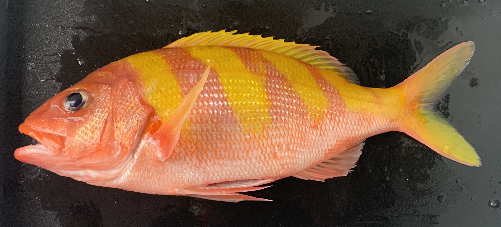

# Life History Updates

**Parameter Definitions:**

***T~max~*** **(maximum age)** – The maximum observed age revealed from an otolith-based age determination study. *T~max~* values can be derived from ages determined by annuli counts of sagittal otolith sections and/or bomb radiocarbon (^14^C) analysis of otolith core material. Units are years.

***L~∞~*****(asymptotic length)** – One of three coefficients of the VBGF that measures the mean maximum length at which the growth curve plateaus and no longer increases in length with increasing age. This coefficient reflects the estimated mean maximum length and not the observed maximum length. Units are centimeters.

***k*** **(growth coefficient)** – One of three coefficients of the VBGF that measures the shape and steepness by which the initial portion of the growth function approaches its mean maximum length (*L~∞~*).

***t~0~*** **(hypothetical age at length zero)** – One of three coefficients of the VBGF whose measure is highly influenced by the other two VBGF coefficients (*k* and *L~∞~*) and typically assumes a negative value when specimens representing early growth phases) are not available for age determination. This parameter can be fixed at 0. Units are years.

***M*** **(natural mortality)** – This is a measure of the mortality rate for a fish stock and is considered to be directly related to stock productivity (i.e., high *M* indicates high productivity and low *M* indicates low stock productivity). *M* can be derived through use of various equations that link *M* to *T~max~* and the VBGF coefficients (*k* and *L~∞~*) or by calculating the value of the slope from a regression fit to a declining catch curve (regression of the natural logarithm of abundance versus age class) derived from fishing an unfished or lightly fished population.

***A~50~*** **(age at 50% maturity)** – Age at which 50% of the sampled stock under study has attained reproductive maturity. This parameter is best determined based on studies that concurrently determine both age (otolith-based age data) and reproductive maturity status (logistic function fitted to percent mature by age class with maturity determined via microscopic analyses of gonad histology preparations). A more approximate means of estimating *A~50~* is to use an existing *L~50~* estimate to find the corresponding age (*A~50~*) from an existing VBGF curve. Units are years.

***A∆~50~*** **(age of sex switching)** – Age at which 50% of the immature and adult females of the sampled stock under study is undergoing or has attained sex reversal. This parameter is best determined based on studies that concurrently determines both age (otolith-based age data) and reproductive sex reversal status (logistic function fitted to percent sex reversal by age class with sex reversal determined via microscopic analyses of gonad histology preparations). A more approximate means of estimating *A∆~50~* is to use an existing *L∆~50~* estimate to find the corresponding age (*A∆~50~*) from the VBGF curve. Units are years.

***L~50~*** **(length at which 50% of a fish population are capable of spawning)** – Length at which 50% of the females of a sampled stock under study has attained reproductive maturity; this is the length associated with *A~50~* estimates. This parameter is derived using a logistic function to fit the percent mature data by length class with maturity status best determined via microscopic analyses of gonad histology preparations. *L~50~* information is typically more available than *A~50~* since *L~50~* estimates do not require knowledge of age and growth. Units are centimeters.

***L∆~50~*** **(length of sex switching)** – Length at which 50% of the immature and adult females of the sampled stock under study is undergoing or has attained sex reversal; this is the length associated with *A∆~50~* estimates. This parameter is derived using a logistic function to fit the percent sex reversal data by length class with sex reversal status best determined via microscopic analyses of gonad histology preparations. *L∆~50~* information is typically more available than *A∆~50~* since *L∆~50~* estimates do not require knowledge of age and growth. Units are centimeters.

 

**Mariana Islands**

{width="800"}

 

{width="800"}

 

{width="200"} **Gindai (*Pristipomoides zonatus*)**

Updates to gindai life history are continuing with additional sampling and updates to the 2021 life history assessment. Ginadi are moderately long lived, with maximum age recorded of 30 years in Guam. Males obtain a larger average size and a larger asymptotic size (+3.03 cm, 1.2 inches) fork length (FL) than females. Gindai have a long spawning season and spawn often, suggesting high reproductive output.

Highlights

-   Size ranged from 11.5 to 40.4 cm. (4.5 – 15.9 inches) FL.

-   Maximum age for gindai from Guam was 30 years, but individuals in the Northern Marianas Islands have been found as old as 38 years.

-   Female size at maturity was 24.0 cm FL at 3.4 years. - Spawning occurred May through September.

 

{width="200"} **Yellow-Edged Lyretail (*Variola louti*)**

Groupers (Family Epinephelidae) are important to commercial, subsistence, and recreational fisheries throughout the world. Grouper species have complex life histories that make them more vulnerable to exploitation. Age, growth, and reproduction were assessed from fishery-dependent samples collected around Guam from 2010 to 2017.

Highlights Size ranged from 19.4 to 49.7 cm. (7.6 – 19.6 inches) FL.

-   Maximum age was 17 years, but individuals over 10 years old are rare.

-   Yellow-edged lyretail is a protogynous hermaphrodite (all males are derived from females) with an average size at sex change of 35.3 cm (13.9 inches) FL at 6.1 years.

-   Some spawning occurs all year but there is a peak from October through March.

 

{width="200"} **Yellowtail Kalekale, Goldenflag Snapper (*Pristipomoides auricilla*)**

Goldenflag jobfish are younger in fished areas (Guam and Saipan) compared to unfished areas in the Northern Marianas Islands. Maximum age in the Marianas found to date is 32 years, however the oldest individual from around Guam was only 10 years. The reproduction is currently being assessed. There is a long spawning season from spring through summer with spawning occurring every few days during the spawning season. 

Highlights

-   Maximum size in the Marianas Islands was found to be 40.3 cm (15.9 inches) FL and maximum age was  32 years. 

-   The preliminary size at maturity is 23.7 cm (9.3 inches) FL.

 

**American Samoa**

{width="800"}

 

**Hawaiʻi**

{width="800"}

 

{width="200"} **ʻŌpakapaka (*Pristipomoides filamentosus*)**

ʻŌpakapaka is assessed and managed as part of a seven species bottomfish complex called the Deep-7. Age, growth, and reproduction were assessed from fishery-dependent samples collected from the Northwest and Main Hawaiian Islands. Life history information is currently being updated for this species since updates in otolith processing and ageing have improved the ageing for this species.

 

{width="200"} **Onaga (*Etelis coruscans*)**

Onaga reproduction was recently published and is result of a collaborative project between fishers, restaurants, and the Life History Program. The size at maturity was found to be around 65.8 cm (25 inches) with a spawning season from September through December.

The full study is available here: <https://www.frontiersin.org/articles/10.3389/fmars.2023.1102388/full>.
