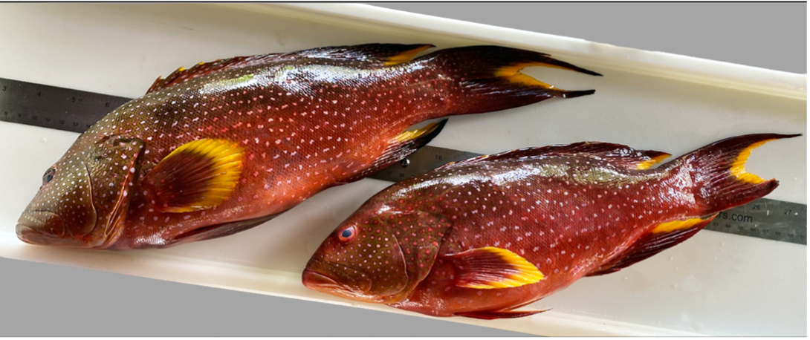
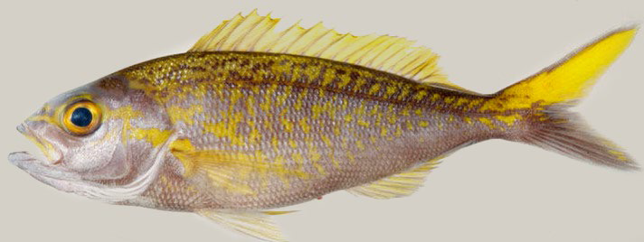

```{r setup, include=FALSE}
library(flexdashboard)
library(lubridate)
library(magrittr)
library(ggplot2)
library(dplyr)
library(tidyr)
library(gridExtra)
library(htmltools)


# Install thematic and un-comment for themed static plots (i.e., ggplot2)
# thematic::thematic_rmd()
```

```{r}
here::i_am("biosampling.Rmd")


```

```{r global, include=FALSE}
# load data in 'global' chunk so it can be shared by all users of the dashboard


data <- read.csv("~/Documents/github/LHP_flexdashboard/data/all_samples_2_2024_commonname_noSI.csv")

#pull BMUS and priority non-BMUS species
#test first with BMUS only
BMUS<-c("Aphareus rutilans","Aprion virescens", 
  "Caranx ignobilis",  
  "Caranx lugubris",  
  "Etelis carbunculus",  
  "Etelis coruscans",  
  "Lethrinus rubrioperculatus" , 
  "Lutjanus kasmira"  ,
  "Pristipomoides auricilla"  ,
  "Pristipomoides filamentosus"  ,
  "Pristipomoides flavipinnis"  ,
  "Pristipomoides sieboldii"  ,
  "Pristipomoides zonatus"  ,
  "Variola louti")

#Guam ecosystem species >=50n
Gcoral<-c("Caranx melampygus", 
"Cheilinus undulatus",
"Epinephelus fasciatus",
"Lethrinus obsoletus",
"Siganus punctatus")

#CNMI ecosystem species >=50n
Ccoral<-c("Acanthurus lineatus",
"Acanthurus nigricauda",
"Acanthurus triostegus",
"Calotomus carolinus",
"Caranx melampygus",
"Cephalopholis argus",
"Cheilinus trilobatus",
"Cheilinus undulatus",
"Chlorurus sordidus",
"Kyphosus cinerascens",
"Lethrinus obsoletus",
"Monotaxis grandoculis",
"Mulloidichthus vanicolensis",
"Naso lituratus",
"Naso unicornis",
"Sargocentron spiniferum",
"Sargocentron tiere",
"Scarus ruboviolaceus", 
"Siganus punctatus",
"Siganus spinus",
"Zanclus cornutus")
  
all<-c("Aphareus rutilans","Aprion virescens", 
  "Caranx ignobilis",  
  "Caranx lugubris",  
  "Etelis carbunculus",  
  "Etelis coruscans",  
  "Lethrinus rubrioperculatus" , 
  "Lutjanus kasmira",
  "Pristipomoides auricilla" ,
  "Pristipomoides filamentosus" ,
  "Pristipomoides flavipinnis",
  "Pristipomoides sieboldii" ,
  "Pristipomoides zonatus" ,
  "Variola louti",
  "Caranx melampygus",
"Cheilinus undulatus",
"Epinephelus fasciatus",
"Lethrinus obsoletus",
"Siganus punctatus",
"Acanthurus lineatus",
"Acanthurus nigricauda",
"Acanthurus triostegus",
"Calotomus carolinus",
"Caranx melampygus",
"Cephalopholis argus",
"Cheilinus trilobatus")


#subset data 
data<-data |> subset(ScientificName %in% all)

#fix common names to only one per scientific name
#unique(data$CommonName)

cname<-c("SILVERMOUTH", "UKU","GIANT TREVALLY", "BLACK JACK", "EHU SNAPPER", "ONAGA SNAPPER", "REDGILL EMPEROR", "BLUELINED SNAPPER", "YELLOWTAIL KALIKALI", "PINK OPAKAPAKA", "YELLOWEYE OPAKAPAKA","KALIKALI","GINDAI", "LYRETAIL GROUPER")

Gcoral_cn<-c("BLUEFIN TREVALLY","NAPOLEON WRASSE", "BLACKTIP GROUPER", "ORANGE-STRIPED EMPEROR","GOLD-SPOTTED RABBITFISH")

Ccoral_cn<-c("BLUEBANDED SURGEONFISH", "EPAULETTE SURGEONFISH", "CONVICT TANG", "BUCKTOOTH PARROTFISH", "BLUEFIN TREVALLY", "PEACOCK GROUPER", "TRIPLETAIL WRASSE", "NAPOLEON WRASSE","BULLETHEAD PARROTFISH", "HIGHFIN RUDDERFISH", "BIGEYE EMPEROR","YELLOWFIN GOATFISH", "ORANGESPINE UNICORNFISH", "BLUESPINE UNICORNFISH", "SABER SQUIRRELFISH", "TAHITIAN SQUIRRELFISH", "REDLIP PARROTFISH", "SCRIBBLED RABBITFISH", "MOORISH IDOL")

all_cn<-c("SILVERMOUTH",
          "UKU",
          "GIANT TREVALLY", 
          "BLACK JACK",
          "EHU SNAPPER",
          "ONAGA SNAPPER",
          "REDGILL EMPEROR", 
          "BLUELINED SNAPPER", 
          "YELLOWTAIL KALIKALI",
          "PINK OPAKAPAKA", 
          "YELLOWEYE OPAKAPAKA",
          "KALIKALI",
          "GINDAI", 
          "LYRETAIL GROUPER",
          "BLUEFIN TREVALLY",
          "NAPOLEON WRASSE",
          "BLACKTIP GROUPER", 
          "ORANGE-STRIPED EMPEROR",
          "GOLD-SPOTTED RABBITFISH",
          "BLUEBANDED SURGEONFISH",
          "EPAULETTE SURGEONFISH", 
          "CONVICT TANG", 
          "BUCKTOOTH PARROTFISH", 
          "BLUEFIN TREVALLY", 
          "PEACOCK GROUPER", 
          "TRIPLETAIL WRASSE", 
          "NAPOLEON WRASSE",
          "BULLETHEAD PARROTFISH", 
          "HIGHFIN RUDDERFISH", 
          "BIGEYE EMPEROR",
          "YELLOWFIN GOATFISH", 
          "ORANGESPINE UNICORNFISH", 
          "BLUESPINE UNICORNFISH", 
          "SABER SQUIRRELFISH",
          "TAHITIAN SQUIRRELFISH", 
          "REDLIP PARROTFISH", 
          "SCRIBBLED RABBITFISH", 
          "MOORISH IDOL")


temp<-data.frame(ScientificName=all, CommonName=all_cn)

data<-dplyr::left_join(data,temp, by="ScientificName")

data<-data|> dplyr::arrange(ScientificName)

#TEMPORARY - test data set
#test_scinames <- c('Aphareus rutilans', 'Acanthurus lineatus', 'Pristipomoides sieboldii')
#test_commonnames <- c('SILVERMOUTH', 'BLUEBANDED SURGEONFISH', 'KALIKALI')
#data <- data |> filter(CommonName %in% test_commonnames & ScientificName %in% test_scinames)
#END TEMPORARY

#set up species and region lists for dropdown menu
region_list <- c("A.Samoa", "A.Samoa_unfished", "Guam", "CNMI", "CNMI_unfished")
species_list <- na.omit((unique(data$ScientificName)))
common_list <-all_cn
#common_list <- na.omit((unique(data$CommonName)))

#dictionary of scientific name : common name
scientific_dict <- species_list
names(scientific_dict) <- common_list

#and common name : scientific name
common_dict <- common_list
names(common_dict) <- species_list

```

# Sidebar {.sidebar}

<span style="color:#005AA8">

<h4>**Choose a region and species**:</h4>

</span>

```{r}
# Select indicator to view - start with SST selected
div(style = "margin-top: -10px; ", #decreases amount of whitespace between label and input selection UI
  selectInput('Region', label = 'Region', choices = region_list, selected = c('Guam'))
)

div(style = "margin-top: -10px; ", #decreases amount of whitespace between label and input selection UI
  selectInput('Species', label = 'Species', choices = species_list, selected = c('Aphareus rutilans'))
)

div(style = "margin-top: -10px; ", #decreases amount of whitespace between label and input selection UI
  selectInput('Name', label = 'Common Name', choices = common_list, selected = c('SILVERMOUTH'))
)

#When common name changes, update scientific name
observeEvent(input$Name, {
  updateSelectInput(session, 'Species', label = NULL, choices = species_list, selected = scientific_dict[input$Name])
})

#when scientific name changes, update common name
observeEvent(input$Species, {
  updateSelectInput(session, 'Name', label = NULL, choices = common_list, selected = common_dict[input$Species])
})

```

# Species Summaries

## Row {data-height="150"}

```{r}

output$text_summary <- renderUI({

  # Filter data
  temp <- data |> filter(Region == input$Region, ScientificName == input$Species)
#temp=data  #for troubleshooting
temp<-temp[complete.cases(temp$Length.cm.),] 
  #temp$Month<-month(temp$Date, label=TRUE) #keeps month data in date format for plotting in order
  tempm<-temp%>% 
   na.omit(temp)
  Months<-c("Jan", "Feb", "Mar", "Apr", "May", "Jun", "July", "Aug", "Sep", "Oct", "Nov", "Dec")
  Mn=c(1:10, 1)
  Months<-as.data.frame(Months)
  Months<-as.factor(Months$Months)
  tempm<-temp %>%
    dplyr::group_by(Month)%>%
    dplyr::summarize(N_month=length(Length.cm.))
  maxm<-max(tempm$N_month, na.rm=TRUE)
  maxm<-if (maxm >=20) maxm else 20
  tempm<-tidyr::complete(tempm, Month, fill=list(N_Month=0))
  gsi<-temp %>% 
    dplyr::mutate(GSI=(GonWeight/Weight.g.)*100)
  
  #join into list
  build_list<-list(temp, tempm, gsi)
  names(build_list)<- c('temp','tempm','gsi')
  final_list<-build_list
  sample_size=length(final_list$temp$Length.cm.)
  length_min<-min(final_list$temp$Length.cm., na.rm=TRUE)
  length_max<-max(final_list$temp$Length.cm., na.rm=TRUE)
  length_median<-median(final_list$temp$Length.cm., na.rm=TRUE)
  gender<-final_list$temp %>%
    dplyr::group_by(Sex)%>%
    dplyr::summarize(n_females=length(Sex=="F"))
  female=gender[1,2]
  male=gender[2,2]
  unknown=gender[3,2]
  
  maxm<-max(final_list$tempm$N_month, na.rm=TRUE)
  maxm<-if (maxm >=20) maxm else 20
  
  #unpretty formatting but I could not get inline variables (line below) to work
  paste0("A total of ", sample_size, " samples (females=", female, ", males=", male,
         ", unknown/na=", unknown, ") have been collected to date. Median fork length is ",
         length_median, " cm (min=", length_min, "cm, max=", length_max, " cm).")
  
  #markdown("A total of `r sample_size` samples (females=`r female`, males=`r male`, unknown/na=`r unknown`) have been collected to date. Median fork length is `r median` cm (min=`r min` cm, max=`r max` cm).")
  
})
  
uiOutput("text_summary")

```

## Row {data-height="550"}

```{r}

output$four_panel_plot <- renderPlot({

  # Filter data
  temp <- data |> filter(Region == input$Region, ScientificName == input$Species)
  temp<-temp[complete.cases(temp$Length.cm.),] 
  #temp$Month<-month(temp$Date, label=TRUE) #keeps month data in date formatt for plotting in order
  tempm<-temp 
   # na.omit(temp)
  Months<-c("Jan", "Feb", "Mar", "Apr", "May", "Jun", "July", "Aug", "Sep", "Oct", "Nov", "Dec")
  Mn=c(1:10, 1)
  Months<-as.data.frame(Months)
  Months<-as.factor(Months$Months)
  tempm<-tempm %>%
    dplyr::group_by(Month)%>%
    dplyr::summarize(N_month=length(Length.cm.))
  maxm<-max(tempm$N_month, na.rm=TRUE)
  maxm<-if (maxm >=20) maxm else 20
  tempm<-complete(tempm, Month, fill=list(N_Month=0))
  gsi<-temp %>% 
    dplyr::mutate(GSI=(GonWeight/Weight.g.)*100)
  
  #join into list
  build_list<-list(temp, tempm, gsi)
  names(build_list)<- c('temp','tempm','gsi')
  final_list<-build_list
  length_min<-min(final_list$temp$Length.cm., na.rm=TRUE)
  length_max<-max(final_list$temp$Length.cm., na.rm=TRUE)
  
    bin_width=2
    nbins <- seq(length_min - bin_width,
                 length_max + bin_width,
                 by = bin_width)
    p1 <- ggplot(data=temp, aes(x=Length.cm.))+geom_histogram(binwidth=2,breaks=nbins, color="black", aes(fill=Sex)) + 
      xlab("Fork Length (cm)") +  ylab("Frequency") + ggtitle("Size Distribution")+
      scale_fill_manual(values=c("red", "blue", "white", "black"))+
      theme_bw() + theme(panel.border = element_blank(), panel.grid.major = element_blank(),
                         panel.grid.minor = element_blank(), axis.line = element_line(colour = "black"), legend.position="none")+scale_x_continuous(limits = c(length_min-2, length_max+2))
    
    
    #monthly samples
    p2<-ggplot(tempm, aes(x=Month, y=tempm$N_month)) + 
      geom_bar(stat = "identity")+xlab("") +  ylab("Frequency") + ggtitle("Monthly Sample Distribution")+
      geom_hline(yintercept = 20, colour="red", linetype = "dashed")+ theme_bw() + theme(panel.border = element_blank(), panel.grid.major = element_blank(),
                                                                                         panel.grid.minor = element_blank(), axis.line = element_line(colour = "black"), legend.position="none")
    
    #GSI
    p3<-ggplot(gsi, aes(x=Length.cm., y=GSI, color=Sex)) +  xlab("Fork Length (cm)") +  ylab("GSI") + ggtitle("GSI & Fish Length")+
      geom_point(aes(colour=Sex), size=2) +
      geom_point(shape = 1,size=2, colour = "black") + scale_color_manual(values=c("red", "blue", "white", "black"))+
      theme_bw() + theme(panel.border = element_blank(), panel.grid.major = element_blank(),
                         panel.grid.minor = element_blank(), axis.line = element_line(colour = "black"), legend.position="none")
    
    
    #Spawning Season
    gsi_f<-gsi %>% 
      subset(Sex=="F")
    #gsi_f$Month<-month(gsi_f$Date, label=TRUE)
    
    p4<-ggplot(gsi_f, aes(x=as.factor( Month), y=GSI)) + 
      geom_boxplot(fill="red") +
      xlab("") +  ylab("GSI") + ggtitle("Spawning Season")+
      theme_bw() + theme(panel.border = element_blank(), panel.grid.major = element_blank(),
                         panel.grid.minor = element_blank(), axis.line = element_line(colour = "black"), legend.position="none")+scale_x_discrete(limits = month.abb)
    
    grid.arrange(p1,p2,p3,p4 , nrow = 2)
}
)

plotOutput("four_panel_plot")

```

# About

Appropriate collections of biological samples are crucial for understanding fish life history and population dynamics needed for sustainable fisheries management. These samples provide estimates of length at age, growth rates, longevity, aspects of reproduction (size and age at maturity, fecundity, spawning season), and mortality. This information is used to inform stock assessments, including those that use a data-poor approach. Life history information is also important to local management agencies when setting size limits and closed seasons to protect fish while they are spawning and ultimately increase fish population productivity. Finally, fish life history is expected to change in response to climate change; therefore, providing baseline information under current conditions is needed to document and understand future impacts.

Pacific Islands Fisheries Science Center, Life History Program samples insular fish species in the U.S. Pacific jurisdictions via the Commercial Fisheries Biosampling Programs (CFBS) and NOAA Life History Program research surveys. This dashboard summaries our biosampling collections to date for Guam, The Common Wealth of the Northern Mariana Islands (CNMI), and American Samoa. For more information please see the full biosamling inventory report available at: <https://repository.library.noaa.gov/view/noaa/45018>.

# Life History Updates

**Mariana Islands**

{width="200"} **Gindai (*Pristipomoides zonatus*)**

Updates to gindai life history are continuing with additional sampling and updates to the 2021 life history assessment. Ginadi are moderately long lived, with maximum age recorded of 30 years in Guam. Males obtain a larger average size and a larger asymptotic size (+3.03 cm, 1.2 inches) fork length (FL) than females. Gindai have a long spawning season and spawn often, suggesting high reproductive output.

Highlights

-   Size ranged from 11.5 to 40.4 cm. (4.5 – 15.9 inches) FL.

-   Maximum age for gindai from Guam was 30 years, but individuals in the Northern Marianas Islands have been found as old as 38 years.

-   Female size at maturity was 24.0 cm FL at 3.4 years. - Spawning occurred May through September.

{width="200"} **Yellow-Edged Lyretail (*Variola louti*)**

Groupers (Family Epinephelidae) are important to commercial, subsistence, and recreational fisheries throughout the world. Grouper species have complex life histories that make them more vulnerable to exploitation. Age, growth, and reproduction were assessed from fishery-dependent samples collected around Guam from 2010 to 2017.

Highlights Size ranged from 19.4 to 49.7 cm. (7.6 – 19.6 inches) FL.

-   Maximum age was 17 years, but individuals over 10 years old are rare.

-   Yellow-edged lyretail is a protogynous hermaphrodite (all males are derived from females) with an average size at sex change of 35.3 cm (13.9 inches) FL at 6.1 years.

-   Some spawning occurs all year but there is a peak from October through March.

{width="200"} **Yellowtail Kalekale, Goldenflag Snapper (*Pristipomoides auricilla*)**

Goldenflag jobfish are younger in fished areas (Guam and Saipan) compared to unfished areas in the Northern Marianas Islands. Maximum age in the Marianas found to date is 32 years, however the oldest individual from around Guam was only 10 years. The reproduction is currently being assessed. There is a long spawning season from spring through summer with spawning occurring every few days during the spawning season. 

Highlights

-   Maximum size in the Marianas Islands was found to be 40.3 cm (15.9 inches) FL and maximum age was  32 years. 

-   The preliminary size at maturity is 23.7 cm (9.3 inches) FL.


